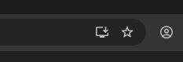
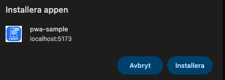
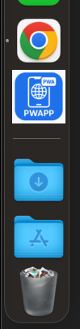
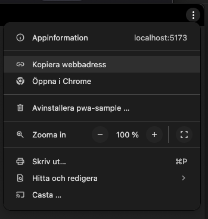

# A Simple Example of How to Transform a Web Application Into a Progressive Web App

---

The purpose of this document is to demonstrate a simple and practical approach for transforming an ordinary web application into a Progressive Web App (PWA), and how the content of the application can be separated depending on whether the user is accessing it through a browser or via the installed app.

This report does not aim to describe the inner workings of PWAs, recommended best practices, caching strategies, offline behavior, or any technical implementation details.

Instead, the focus is  on illustrating how a single client can act as two different user experiences:

- a regular webbsite experience
-  app-like experience

This sample will create the PWA using the popular frontend library [React](https://react.dev/)

Accessed via the browser:
![[Pasted image 20251121110001.png]]

Accessed via the installed App:
![[Pasted image 20251121110044.png]]

---
## What Is a PWA?

A PWA (Progressive Web App) is essentially a regular website that can also function like a mobile application.

It can be installed on a mobile device, launch in its own window, and offer an app-like interface and experience.
For an overview of PWA fundamentals, general requirements, and recommended practices, refer to:

MDN – Progressive Web Apps Guide

https://developer.mozilla.org/en-US/docs/Web/Progressive_web_apps

---
## PWA requirement

The only requirement to make your webbsite installable as an app, is a manifest.json file.
This file acts like a configuration file for how the application should look and what routes / functionality should be included. 

You then add a link in your index.html file as below:
`<link rel="manifest" href="manifest.json">`

....and thats it! If you're on chrome, you now have an installable webb-app!

**sample manifest.json**
```json
{
"short_name": "pwa",
"name": "pwa-sample",
"icons": [
	{
	"src": "/wapp.png",
	"sizes": "200x200",
	"type": "image/png"
	}
],
"start_url": "/",
"display": "standalone",
"theme_color": "black",
"background_color": "white"
}
```

### Browser support

Support for PWA installation promotion from the web varies by browser and by platform.

On desktop:

- Chromium browsers support installing PWAs that have a manifest file on all supported desktop operating systems.
- Safari supports Add to Dock (_File_ > _Add to Dock..._) on macOS Sonoma (Safari 17) and later for any web app with or without a manifest file.
- Firefox does not support installing PWAs using a manifest file.

On mobile:

- On Android, Firefox, Chrome, Edge, Opera, and Samsung Internet Browser all support installing PWAs.
- On iOS 16.3 and earlier, PWAs can only be installed with Safari.
- On iOS 16.4 and later, PWAs can be installed from the Share menu in Safari, Chrome, Edge, Firefox, and Orion.

source: https://developer.mozilla.org/en-US/docs/Web/Progressive_web_apps/Guides/Making_PWAs_installable#browser_support

---
### Separating Content Between Web Mode and App Mode

A central idea in this sample is to demonstrate how one and the same client can present different views depending on how it is being accessed. A modern web application can identify whether it is running inside a standard browser tab or as an installed Progressive Web App. Based on this information, it can adapt its interface and selectively expose functionality that is relevant only in one of the contexts.

This sample will create the PWA using the popular frontend library [React](https://react.dev/)

---
## Implement the PWA

**Requirements for you to be able to follow along**
- You need node.js installed, if not installed head to node and follow the instructions. [Install Node Instructions](https://nodejs.org/en)
- Chrome browser
- Internet connection (obviously)

1. Clone the repo using `git clone <repo>`
2. cd into pwa-sample using `cd pwa-sample`
3. run `npm run dev`

You should now how the default webbsite experience, it's not much, just a friendly title!


Now if you haven't already, open the webbsite using the Chrome browser.
In the URL window - you should see this icon (computer):


This tells you that you can install the webbsite as an application, click install.



You should now have it installed and act as an app, notice that the URL part of the screen has also disappeared.


You can also see that the app is installed as an app


It can also be docked (MacOS)


To uninstall the App, simple open the app and press the 3 dots in the right corner, then press "uninstall"



---
### Wrap-up

Ok - so we just saw an example of 1 client showing two different messages (components). How is this done?
In this example we used React framework to create the logic for rendereing the correct component.

```js
/**
 * This is the main method for the application
 * When the component is rendered 'useEffect' is called
 * it then checks the current-display mode and updates on change.
 * 
 * The result is, if display-mode is standalone (app) we render
 * the pwa component, else we render the web component
 */
function App() {
  const [isPwa, setIsPwa] = useState(false);

  useEffect(() => {
    // set initialValue
    const mediaQuery = window.matchMedia("(display-mode: standalone)");
    setIsPwa(mediaQuery.matches);

    // Update value on change
    const listener = (event) => {
      setIsPwa(event.matches);
    }

    // Add event
    mediaQuery.addEventListener("change", listener);

    // clean-up to avoid multiple eventListeners
    return () => {
      mediaQuery.removeEventListener("change", listener);
    }
  }, []);

  // Render component based on display-mode
  const RenderComponent = isPwa ? Pwa : Web;

  return (
    <>
      <Router>
        <Routes>
          <Route path="/" element={<RenderComponent className="pwa" />} />
        </Routes>
      </Router>
    </>
  );
}
```
